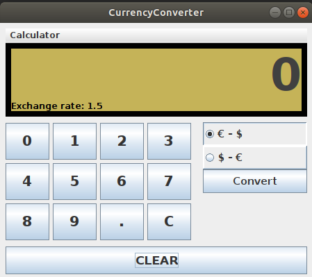
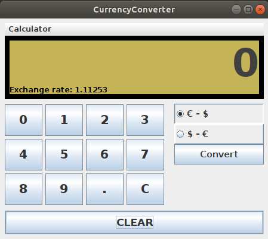

# CurrencyConverter
Interactive application that converts currencies based on the given exchange rates made in MVC

## Table of contents
* [General info](#general-info)
* [Screenshots](#screenshots)
* [Technologies](#technologies)
* [Features](#features)

## General info
Project made for the subject Human Computer Interaction on the Universitat de Valencia during my Erasmus+ exchange. The project was made to practise MVC software design pattern, Swing, AWT, events handling and use of listeners.

## Screenshots

## Technologies
* Java - version 13.0.1
* Swing
* AWT

## Features
* converting currencies
* changing currencies
* changing exhange rate
* return to default value of exchange rate

